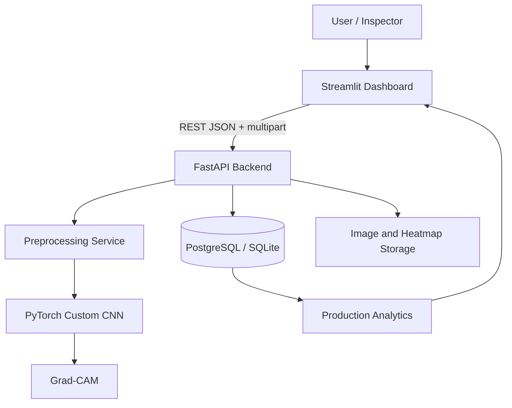

# System Architecture

## Microservice boundaries

1. **Frontend service**: user interaction and analytics visualization.
2. **API service**: validation, orchestration, database transactions, and REST contract.
3. **Model component**: preprocessing, inference, probability scoring, and Grad-CAM.
4. **Database service**: prediction history, ground truth, measured accuracy, and trends.

## Production extension

For higher traffic, split model inference into a dedicated worker service and use Redis/Celery or a message broker. Store images in S3-compatible object storage and deploy the API behind a reverse proxy/load balancer.
